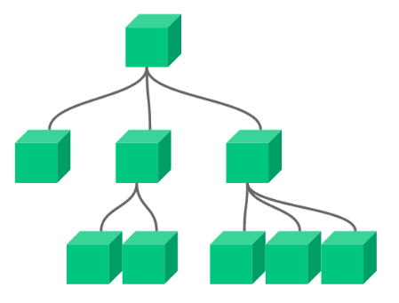

# vue-challennge



### Communication flow between components (Max 3 levels): 
```
Component1 > Component2 > Componet3
*Component3 emit event*
Component1 < Component2 < Componet3

```

## Project
```
Usage: Axios, vue-router, express (server), Heroku Cloud
```
url: [https://vuejs-app-list.herokuapp.com/](https://vuejs-app-list.herokuapp.com/)

### Api Products + Images (Bucket AmazonS3)

url: [https://api-list-simple.herokuapp.com/products](https://api-list-simple.herokuapp.com/products)
github: [https://github.com/tonimota/api-simple](https://github.com/tonimota/api-simple)

## Project setup
```
npm install
```

### Compiles and hot-reloads for development
```
npm run serve (port: 8082)
```

### Compiles and minifies for production
```
npm run build
```

### Run your unit tests
```
npm run test:unit
```
